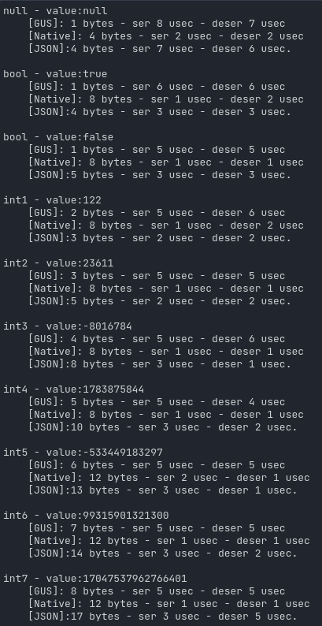
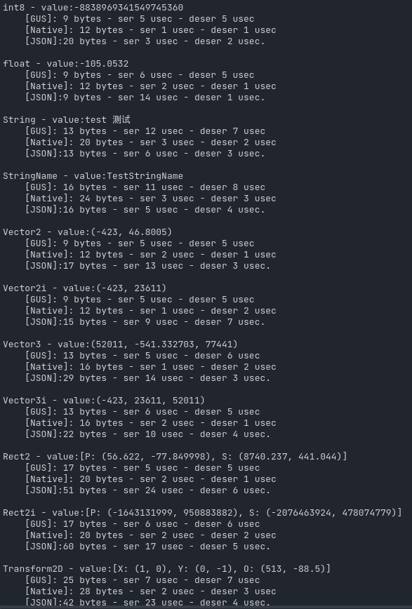
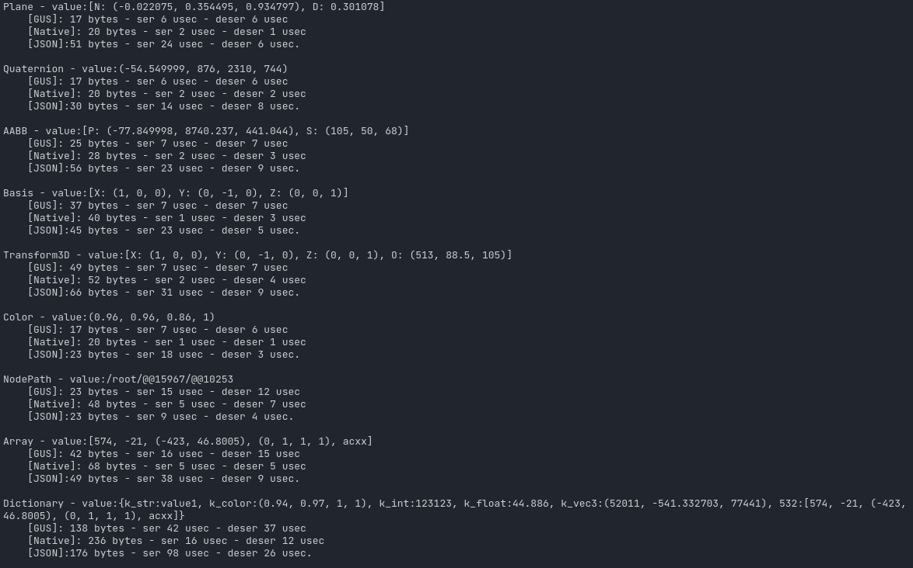
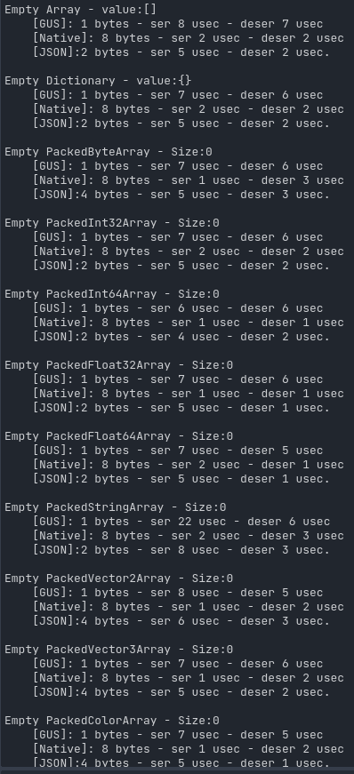
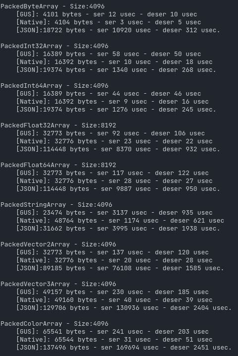

# GUS - Godot Universal Serializer 2.1.0 - Godot的通用序列化器 - V2.1.0


[English doc](README.md) <- click here。

为序列化尺寸优化而构建的 Godot 4.x 通用序列化器。
支持除了 `Object`、 `RID`、 `Callable` 以及 `Signal` 以外的 Godot4.x 的所有内建数据类型。

# 特点:
  1. 不丢失类型信息。在跨端传送时不需要类型检测和类型强制转换，就像本地传参一般。
  2. 整形是变长序列化。
  3. 相比 Godot 的原生序列化方法 `var_to_bytes()` 和转换成`JSON`再转`UTF8`数据, `GUS`的序列化后数据尺寸有显著的减少。尤其适用于多人游戏中需要传输的小型数据结构的序列化。
  4. 多数情况下效率甚至比原生序列化更高。
  5. `GDExtension` 插件，具有较高的性能。

  可以通过运行名为`GUS_benchmark.gd`的编辑器脚本来查看 `GUS`、`Native` 以及 `JSON` 这三种方式的剧烈话反序列化测试对比。

# 如何使用:
  1. 下载发布的插件包，像其他插件一样安装~~和启用~~即可。
  2. ~~根据你的需求代码修改名为`GUS`的Autoload的属性.~~
  3. 传递不包含`Object`、 `OID`、 `Callable`以及 `Signal`的变量给 `GUS.var_to_bytes()`并获取序列化后数据，然后发送给其他网络对等体。
  3. 远端的网络对等体获取到序列化后数据，传递给`GUS.bytes_to_var()`,即可获得与序列化前相同的变量。


# 注意:
  1. ~~不同端的`GUS`属性必须保持一致才能正确反序列化。~~
  2. `Array` 和 `Dictionary` 不能包含 `Object`、`RID`、`Callable`以及`Signal`。
  3. ~~当前不支持`typeof double real_t`的自定义构建Godot 4.x版本。~~
  4. 当前仅支持`windows`.
	
# TODO:
  1. ~~如果我找到绑定静态方法给`GDScript`的办法，我将抛弃自动加载`GUS`, 改为静态方法的方式去实现功能。~~
  2. 编译`linux`和`osx`版本(但我碰上了我无法处理的编译错误)。
  3. ~~编译`typeof double real_t`版本以支持自定义构建Godot 4.x版本(但我碰上了我无法处理的编译错误)。~~
  4. 处理 `Object`、`RID`、`Callable`以及`Signal`。

# 如何编译:
  1. 根据[官方文档](https://docs.godotengine.org/zh_CN/stable/development/compiling/index.html)搭建你的编译环境。
  1. 克隆这个仓库(以递归的方式)。
  3. 导航到`godot-cpp`文件夹，运行下方命令:

    cd godot-cpp
    scons
  4. 导航到仓库根目录,再次运行构建命令 :
    
    scons
  5. 现在,你能再`\demo\addons\com.daylily_zeleen.godot_universal_serializer`获得该插件.

# 基准测试 2.1.0:
```
null - value:<null>
	[GUS]: 		1 bytes 		ser 5 usec 		deser 2 usec
	[Native]: 	4 bytes 		ser 2 usec 		deser 2 usec
	[JSON]:		4 bytes 		ser 8 usec 		deser 5 usec.

bool - value:true
	[GUS]: 		1 bytes 		ser 2 usec 		deser 1 usec
	[Native]: 	8 bytes 		ser 1 usec 		deser 1 usec
	[JSON]:		4 bytes 		ser 4 usec 		deser 3 usec.

bool - value:false
	[GUS]: 		1 bytes 		ser 2 usec 		deser 1 usec
	[Native]: 	8 bytes 		ser 1 usec 		deser 1 usec
	[JSON]:		5 bytes 		ser 3 usec 		deser 2 usec.

int1 - value:122
	[GUS]: 		3 bytes 		ser 3 usec 		deser 1 usec
	[Native]: 	8 bytes 		ser 1 usec 		deser 2 usec
	[JSON]:		3 bytes 		ser 4 usec 		deser 2 usec.

int2 - value:23611
	[GUS]: 		4 bytes 		ser 2 usec 		deser 1 usec
	[Native]: 	8 bytes 		ser 1 usec 		deser 1 usec
	[JSON]:		5 bytes 		ser 4 usec 		deser 1 usec.

int3 - value:-8016784
	[GUS]: 		5 bytes 		ser 2 usec 		deser 1 usec
	[Native]: 	8 bytes 		ser 1 usec 		deser 1 usec
	[JSON]:		8 bytes 		ser 3 usec 		deser 1 usec.

int4 - value:1783875844
	[GUS]: 		6 bytes 		ser 2 usec 		deser 1 usec
	[Native]: 	8 bytes 		ser 1 usec 		deser 1 usec
	[JSON]:		10 bytes 		ser 3 usec 		deser 2 usec.

int5 - value:-533449183297
	[GUS]: 		7 bytes 		ser 1 usec 		deser 0 usec
	[Native]: 	12 bytes 		ser 1 usec 		deser 0 usec
	[JSON]:		13 bytes 		ser 4 usec 		deser 1 usec.

int6 - value:99315901321300
	[GUS]: 		8 bytes 		ser 2 usec 		deser 0 usec
	[Native]: 	12 bytes 		ser 0 usec 		deser 0 usec
	[JSON]:		14 bytes 		ser 4 usec 		deser 1 usec.

int7 - value:17047537962766401
	[GUS]: 		9 bytes 		ser 2 usec 		deser 1 usec
	[Native]: 	12 bytes 		ser 1 usec 		deser 0 usec
	[JSON]:		17 bytes 		ser 4 usec 		deser 2 usec.

int8 - value:-8838969341549745360
	[GUS]: 		11 bytes 		ser 2 usec 		deser 1 usec
	[Native]: 	12 bytes 		ser 1 usec 		deser 1 usec
	[JSON]:		20 bytes 		ser 4 usec 		deser 2 usec.

float - value:-105.0532
	[GUS]: 		9 bytes 		ser 2 usec 		deser 1 usec
	[Native]: 	12 bytes 		ser 1 usec 		deser 1 usec
	[JSON]:		9 bytes 		ser 11 usec 		deser 2 usec.

String - value:test 测试
	[GUS]: 		13 bytes 		ser 8 usec 		deser 2 usec
	[Native]: 	20 bytes 		ser 3 usec 		deser 2 usec
	[JSON]:		13 bytes 		ser 6 usec 		deser 3 usec.

StringName - value:TestStringName
	[GUS]: 		16 bytes 		ser 5 usec 		deser 2 usec
	[Native]: 	24 bytes 		ser 1 usec 		deser 2 usec
	[JSON]:		16 bytes 		ser 5 usec 		deser 3 usec.

Vector2 - value:(-423, 46.8005)
	[GUS]: 		9 bytes 		ser 3 usec 		deser 1 usec
	[Native]: 	12 bytes 		ser 1 usec 		deser 1 usec
	[JSON]:		17 bytes 		ser 12 usec 		deser 3 usec.

Vector2i - value:(-423, 23611)
	[GUS]: 		9 bytes 		ser 2 usec 		deser 1 usec
	[Native]: 	12 bytes 		ser 1 usec 		deser 1 usec
	[JSON]:		15 bytes 		ser 7 usec 		deser 3 usec.

Vector3 - value:(52011, -541.3327, 77441)
	[GUS]: 		13 bytes 		ser 2 usec 		deser 2 usec
	[Native]: 	16 bytes 		ser 1 usec 		deser 1 usec
	[JSON]:		27 bytes 		ser 12 usec 		deser 3 usec.

Vector3i - value:(-423, 23611, 52011)
	[GUS]: 		13 bytes 		ser 3 usec 		deser 1 usec
	[Native]: 	16 bytes 		ser 1 usec 		deser 1 usec
	[JSON]:		22 bytes 		ser 9 usec 		deser 3 usec.

Vector4 - value:(5211, -541.327, 7441, 1.23)
	[GUS]: 		17 bytes 		ser 2 usec 		deser 1 usec
	[Native]: 	20 bytes 		ser 1 usec 		deser 1 usec
	[JSON]:		30 bytes 		ser 19 usec 		deser 4 usec.

Vector4i - value:(-42, 49947, 5211, 445)
	[GUS]: 		17 bytes 		ser 2 usec 		deser 1 usec
	[Native]: 	20 bytes 		ser 1 usec 		deser 1 usec
	[JSON]:		25 bytes 		ser 11 usec 		deser 3 usec.

Projection - value:
8740.2373046875, 0, 0, 0
0, 441.044006347656, 0, 0
0, 0, 1, 0
56.6220016479492, -77.8499984741211, 0, 1
	[GUS]: 		65 bytes 		ser 3 usec 		deser 1 usec
	[Native]: 	68 bytes 		ser 2 usec 		deser 2 usec
	[JSON]:		110 bytes 		ser 38 usec 		deser 7 usec.

Rect2 - value:[P: (56.622, -77.85), S: (8740.237, 441.044)]
	[GUS]: 		17 bytes 		ser 2 usec 		deser 1 usec
	[Native]: 	20 bytes 		ser 0 usec 		deser 1 usec
	[JSON]:		47 bytes 		ser 17 usec 		deser 4 usec.

Rect2i - value:[P: (212324253, -889008718), S: (-32502403, 361586470)]
	[GUS]: 		17 bytes 		ser 2 usec 		deser 1 usec
	[Native]: 	20 bytes 		ser 1 usec 		deser 1 usec
	[JSON]:		57 bytes 		ser 13 usec 		deser 5 usec.

Transform2D - value:[X: (1, 0), Y: (0, -1), O: (513, 88.5)]
	[GUS]: 		25 bytes 		ser 3 usec 		deser 1 usec
	[Native]: 	28 bytes 		ser 1 usec 		deser 2 usec
	[JSON]:		41 bytes 		ser 17 usec 		deser 3 usec.

Plane - value:[N: (-0.022075, 0.354495, 0.934797), D: 0.301078]
	[GUS]: 		17 bytes 		ser 2 usec 		deser 1 usec
	[Native]: 	20 bytes 		ser 1 usec 		deser 2 usec
	[JSON]:		51 bytes 		ser 16 usec 		deser 4 usec.

Quaternion - value:(-54.55, 876, 2310, 744)
	[GUS]: 		17 bytes 		ser 2 usec 		deser 1 usec
	[Native]: 	20 bytes 		ser 1 usec 		deser 1 usec
	[JSON]:		26 bytes 		ser 12 usec 		deser 3 usec.

AABB - value:[P: (-77.85, 8740.237, 441.044), S: (105, 50, 68)]
	[GUS]: 		25 bytes 		ser 6 usec 		deser 2 usec
	[Native]: 	28 bytes 		ser 1 usec 		deser 1 usec
	[JSON]:		52 bytes 		ser 18 usec 		deser 4 usec.

Basis - value:[X: (1, 0, 0), Y: (0, -1, 0), Z: (0, 0, 1)]
	[GUS]: 		37 bytes 		ser 2 usec 		deser 2 usec
	[Native]: 	40 bytes 		ser 1 usec 		deser 1 usec
	[JSON]:		45 bytes 		ser 17 usec 		deser 4 usec.

Transform3D - value:[X: (1, 0, 0), Y: (0, -1, 0), Z: (0, 0, 1), O: (513, -88.5, 105)]
	[GUS]: 		49 bytes 		ser 2 usec 		deser 2 usec
	[Native]: 	52 bytes 		ser 1 usec 		deser 2 usec
	[JSON]:		67 bytes 		ser 25 usec 		deser 5 usec.

Color - value:(1, 1, 1, 1)
	[GUS]: 		17 bytes 		ser 2 usec 		deser 1 usec
	[Native]: 	20 bytes 		ser 2 usec 		deser 1 usec
	[JSON]:		14 bytes 		ser 13 usec 		deser 2 usec.

NodePath - value:/root/@@16380/@@11234
	[GUS]: 		23 bytes 		ser 9 usec 		deser 7 usec
	[Native]: 	48 bytes 		ser 4 usec 		deser 5 usec
	[JSON]:		23 bytes 		ser 8 usec 		deser 3 usec.

Array - value:[574, -21, (-423, 46.8005), (0, 1, 1, 1), "acxx"]
	[GUS]: 		46 bytes 		ser 9 usec 		deser 5 usec
	[Native]: 	68 bytes 		ser 3 usec 		deser 4 usec
	[JSON]:		49 bytes 		ser 29 usec 		deser 8 usec.

Dictionary - value:{ "k_str": "value1", "k_color": (0.9412, 0.9725, 1, 1), "k_int": 123123, "k_float": 44.886, "k_vec3": (52011, -541.3327, 77441), 532: [574, -21, (-423, 46.8005), (0, 1, 1, 1), "acxx"] }
	[GUS]: 		143 bytes 		ser 26 usec 		deser 12 usec
	[Native]: 	236 bytes 		ser 13 usec 		deser 9 usec
	[JSON]:		178 bytes 		ser 64 usec 		deser 21 usec.

Empty Array - value:[]
	[GUS]: 		1 bytes 		ser 3 usec 		deser 1 usec
	[Native]: 	8 bytes 		ser 2 usec 		deser 1 usec
	[JSON]:		2 bytes 		ser 6 usec 		deser 2 usec.

Empty Dictionary - value:{  }
	[GUS]: 		1 bytes 		ser 3 usec 		deser 2 usec
	[Native]: 	8 bytes 		ser 1 usec 		deser 2 usec
	[JSON]:		2 bytes 		ser 5 usec 		deser 2 usec.

Empty PackedByteArray - Size:0
	[GUS]: 		1 bytes 		ser 2 usec 		deser 1 usec
	[Native]: 	8 bytes 		ser 1 usec 		deser 1 usec
	[JSON]:		4 bytes 		ser 6 usec 		deser 2 usec.

Empty PackedInt32Array - Size:0
	[GUS]: 		1 bytes 		ser 2 usec 		deser 1 usec
	[Native]: 	8 bytes 		ser 1 usec 		deser 1 usec
	[JSON]:		2 bytes 		ser 12 usec 		deser 2 usec.

Empty PackedInt64Array - Size:0
	[GUS]: 		1 bytes 		ser 3 usec 		deser 1 usec
	[Native]: 	8 bytes 		ser 2 usec 		deser 1 usec
	[JSON]:		2 bytes 		ser 5 usec 		deser 2 usec.

Empty PackedFloat32Array - Size:0
	[GUS]: 		1 bytes 		ser 3 usec 		deser 1 usec
	[Native]: 	8 bytes 		ser 0 usec 		deser 1 usec
	[JSON]:		2 bytes 		ser 5 usec 		deser 1 usec.

Empty PackedFloat64Array - Size:0
	[GUS]: 		1 bytes 		ser 2 usec 		deser 1 usec
	[Native]: 	8 bytes 		ser 1 usec 		deser 1 usec
	[JSON]:		2 bytes 		ser 5 usec 		deser 2 usec.

Empty PackedStringArray - Size:0
	[GUS]: 		1 bytes 		ser 2 usec 		deser 2 usec
	[Native]: 	8 bytes 		ser 1 usec 		deser 1 usec
	[JSON]:		2 bytes 		ser 5 usec 		deser 2 usec.

Empty PackedVector2Array - Size:0
	[GUS]: 		1 bytes 		ser 2 usec 		deser 2 usec
	[Native]: 	8 bytes 		ser 1 usec 		deser 1 usec
	[JSON]:		4 bytes 		ser 5 usec 		deser 2 usec.

Empty PackedVector3Array - Size:0
	[GUS]: 		1 bytes 		ser 2 usec 		deser 1 usec
	[Native]: 	8 bytes 		ser 1 usec 		deser 1 usec
	[JSON]:		4 bytes 		ser 5 usec 		deser 1 usec.

Empty PackedColorArray - Size:0
	[GUS]: 		1 bytes 		ser 2 usec 		deser 2 usec
	[Native]: 	8 bytes 		ser 1 usec 		deser 1 usec
	[JSON]:		4 bytes 		ser 5 usec 		deser 2 usec.

PackedByteArray - Size:4096
	[GUS]: 		4099 bytes 		ser 11 usec 		deser 7 usec
	[Native]: 	4104 bytes 		ser 5 usec 		deser 7 usec
	[JSON]:		18740 bytes 		ser 1735 usec 		deser 607 usec.

PackedInt32Array - Size:4096
	[GUS]: 		20210 bytes 		ser 68 usec 		deser 41 usec
	[Native]: 	16392 bytes 		ser 7 usec 		deser 8 usec
	[JSON]:		44954 bytes 		ser 3544 usec 		deser 597 usec.

PackedInt64Array - Size:4096
	[GUS]: 		38284 bytes 		ser 162 usec 		deser 77 usec
	[Native]: 	32776 bytes 		ser 16 usec 		deser 12 usec
	[JSON]:		81495 bytes 		ser 3577 usec 		deser 942 usec.

PackedFloat32Array - Size:4096
	[GUS]: 		16387 bytes 		ser 9 usec 		deser 3 usec
	[Native]: 	16392 bytes 		ser 10 usec 		deser 7 usec
	[JSON]:		73736 bytes 		ser 3406 usec 		deser 759 usec.

PackedFloat64Array - Size:4096
	[GUS]: 		32771 bytes 		ser 11 usec 		deser 4 usec
	[Native]: 	32776 bytes 		ser 13 usec 		deser 11 usec
	[JSON]:		80166 bytes 		ser 3089 usec 		deser 702 usec.

PackedStringArray - Size:4096
	[GUS]: 		23472 bytes 		ser 2553 usec 		deser 356 usec
	[Native]: 	48764 bytes 		ser 980 usec 		deser 516 usec
	[JSON]:		31662 bytes 		ser 3216 usec 		deser 1681 usec.

PackedVector2Array - Size:4096
	[GUS]: 		32771 bytes 		ser 8 usec 		deser 6 usec
	[Native]: 	32776 bytes 		ser 16 usec 		deser 11 usec
	[JSON]:		89210 bytes 		ser 7247 usec 		deser 1343 usec.

PackedVector3Array - Size:4096
	[GUS]: 		49155 bytes 		ser 10 usec 		deser 6 usec
	[Native]: 	49160 bytes 		ser 23 usec 		deser 14 usec
	[JSON]:		129660 bytes 		ser 10617 usec 		deser 1967 usec.

PackedColorArray - Size:4096
	[GUS]: 		65539 bytes 		ser 11 usec 		deser 8 usec
	[Native]: 	65544 bytes 		ser 28 usec 		deser 20 usec
	[JSON]:		137478 bytes 		ser 14173 usec 		deser 2278 usec.

Empty Array[bool] - Size:0
	[GUS]: 		1 bytes 		ser 4 usec 		deser 1 usec
	[Native]: 	8 bytes 		ser 0 usec 		deser 2 usec
	[JSON]:		2 bytes 		ser 6 usec 		deser 1 usec.

Empty Array[int] - Size:0
	[GUS]: 		1 bytes 		ser 1 usec 		deser 1 usec
	[Native]: 	8 bytes 		ser 1 usec 		deser 1 usec
	[JSON]:		2 bytes 		ser 3 usec 		deser 1 usec.

Empty Array[float] - Size:0
	[GUS]: 		1 bytes 		ser 1 usec 		deser 1 usec
	[Native]: 	8 bytes 		ser 1 usec 		deser 1 usec
	[JSON]:		2 bytes 		ser 2 usec 		deser 1 usec.

Empty Array[String] - Size:0
	[GUS]: 		1 bytes 		ser 1 usec 		deser 0 usec
	[Native]: 	8 bytes 		ser 1 usec 		deser 1 usec
	[JSON]:		2 bytes 		ser 2 usec 		deser 0 usec.

Empty Array[StringName] - Size:0
	[GUS]: 		1 bytes 		ser 2 usec 		deser 1 usec
	[Native]: 	8 bytes 		ser 0 usec 		deser 1 usec
	[JSON]:		2 bytes 		ser 3 usec 		deser 0 usec.

Empty Array[Vector2] - Size:0
	[GUS]: 		1 bytes 		ser 2 usec 		deser 1 usec
	[Native]: 	8 bytes 		ser 0 usec 		deser 1 usec
	[JSON]:		2 bytes 		ser 3 usec 		deser 0 usec.

Empty Array[Vector2i] - Size:0
	[GUS]: 		1 bytes 		ser 1 usec 		deser 1 usec
	[Native]: 	8 bytes 		ser 0 usec 		deser 0 usec
	[JSON]:		2 bytes 		ser 2 usec 		deser 1 usec.

Empty Array[Vector3] - Size:0
	[GUS]: 		1 bytes 		ser 1 usec 		deser 1 usec
	[Native]: 	8 bytes 		ser 0 usec 		deser 1 usec
	[JSON]:		2 bytes 		ser 2 usec 		deser 1 usec.

Empty Array[Vector3i] - Size:0
	[GUS]: 		1 bytes 		ser 1 usec 		deser 1 usec
	[Native]: 	8 bytes 		ser 0 usec 		deser 1 usec
	[JSON]:		2 bytes 		ser 2 usec 		deser 1 usec.

Empty Array[Vector4] - Size:0
	[GUS]: 		1 bytes 		ser 1 usec 		deser 1 usec
	[Native]: 	8 bytes 		ser 1 usec 		deser 0 usec
	[JSON]:		2 bytes 		ser 3 usec 		deser 1 usec.

Empty Array[Vector4i] - Size:0
	[GUS]: 		1 bytes 		ser 1 usec 		deser 1 usec
	[Native]: 	8 bytes 		ser 0 usec 		deser 1 usec
	[JSON]:		2 bytes 		ser 2 usec 		deser 1 usec.

Empty Array[Projection] - Size:0
	[GUS]: 		1 bytes 		ser 1 usec 		deser 1 usec
	[Native]: 	8 bytes 		ser 1 usec 		deser 0 usec
	[JSON]:		2 bytes 		ser 2 usec 		deser 0 usec.

Empty Array[Rect2] - Size:0
	[GUS]: 		1 bytes 		ser 1 usec 		deser 1 usec
	[Native]: 	8 bytes 		ser 1 usec 		deser 0 usec
	[JSON]:		2 bytes 		ser 2 usec 		deser 1 usec.

Empty Array[Rect2i] - Size:0
	[GUS]: 		1 bytes 		ser 1 usec 		deser 1 usec
	[Native]: 	8 bytes 		ser 0 usec 		deser 0 usec
	[JSON]:		2 bytes 		ser 2 usec 		deser 1 usec.

Empty Array[Transform2D] - Size:0
	[GUS]: 		1 bytes 		ser 1 usec 		deser 1 usec
	[Native]: 	8 bytes 		ser 0 usec 		deser 1 usec
	[JSON]:		2 bytes 		ser 2 usec 		deser 1 usec.

Empty Array[Plane] - Size:0
	[GUS]: 		1 bytes 		ser 2 usec 		deser 0 usec
	[Native]: 	8 bytes 		ser 0 usec 		deser 1 usec
	[JSON]:		2 bytes 		ser 2 usec 		deser 0 usec.

Empty Array[Quaternion] - Size:0
	[GUS]: 		1 bytes 		ser 2 usec 		deser 1 usec
	[Native]: 	8 bytes 		ser 0 usec 		deser 1 usec
	[JSON]:		2 bytes 		ser 2 usec 		deser 0 usec.

Empty Array[AABB] - Size:0
	[GUS]: 		1 bytes 		ser 1 usec 		deser 1 usec
	[Native]: 	8 bytes 		ser 0 usec 		deser 1 usec
	[JSON]:		2 bytes 		ser 2 usec 		deser 1 usec.

Empty Array[Basis] - Size:0
	[GUS]: 		1 bytes 		ser 1 usec 		deser 1 usec
	[Native]: 	8 bytes 		ser 0 usec 		deser 1 usec
	[JSON]:		2 bytes 		ser 2 usec 		deser 1 usec.

Empty Array[Transform3D] - Size:0
	[GUS]: 		1 bytes 		ser 1 usec 		deser 1 usec
	[Native]: 	8 bytes 		ser 0 usec 		deser 0 usec
	[JSON]:		2 bytes 		ser 2 usec 		deser 1 usec.

Empty Array[Color] - Size:0
	[GUS]: 		1 bytes 		ser 1 usec 		deser 1 usec
	[Native]: 	8 bytes 		ser 0 usec 		deser 1 usec
	[JSON]:		2 bytes 		ser 3 usec 		deser 1 usec.

Empty Array[NodePath] - Size:0
	[GUS]: 		1 bytes 		ser 1 usec 		deser 1 usec
	[Native]: 	8 bytes 		ser 1 usec 		deser 0 usec
	[JSON]:		2 bytes 		ser 2 usec 		deser 1 usec.

Empty Array[Array] - Size:0
	[GUS]: 		1 bytes 		ser 2 usec 		deser 0 usec
	[Native]: 	8 bytes 		ser 1 usec 		deser 1 usec
	[JSON]:		2 bytes 		ser 3 usec 		deser 0 usec.

Empty Array[Dictionary] - Size:0
	[GUS]: 		1 bytes 		ser 1 usec 		deser 1 usec
	[Native]: 	8 bytes 		ser 0 usec 		deser 1 usec
	[JSON]:		2 bytes 		ser 2 usec 		deser 1 usec.

Empty Array[PackedByteArray] - Size:0
	[GUS]: 		1 bytes 		ser 1 usec 		deser 1 usec
	[Native]: 	8 bytes 		ser 0 usec 		deser 1 usec
	[JSON]:		2 bytes 		ser 2 usec 		deser 1 usec.

Empty Array[PackedInt32Array] - Size:0
	[GUS]: 		1 bytes 		ser 2 usec 		deser 0 usec
	[Native]: 	8 bytes 		ser 1 usec 		deser 1 usec
	[JSON]:		2 bytes 		ser 2 usec 		deser 2 usec.

Empty Array[PackedInt64Array] - Size:0
	[GUS]: 		1 bytes 		ser 1 usec 		deser 1 usec
	[Native]: 	8 bytes 		ser 1 usec 		deser 0 usec
	[JSON]:		2 bytes 		ser 2 usec 		deser 1 usec.

Empty Array[PackedFloat32Array] - Size:0
	[GUS]: 		1 bytes 		ser 1 usec 		deser 1 usec
	[Native]: 	8 bytes 		ser 0 usec 		deser 1 usec
	[JSON]:		2 bytes 		ser 2 usec 		deser 1 usec.

Empty Array[PackedFloat64Array] - Size:0
	[GUS]: 		1 bytes 		ser 1 usec 		deser 1 usec
	[Native]: 	8 bytes 		ser 1 usec 		deser 0 usec
	[JSON]:		2 bytes 		ser 2 usec 		deser 1 usec.

Empty Array[PackedStringArray] - Size:0
	[GUS]: 		1 bytes 		ser 2 usec 		deser 1 usec
	[Native]: 	8 bytes 		ser 0 usec 		deser 1 usec
	[JSON]:		2 bytes 		ser 3 usec 		deser 0 usec.

Empty Array[PackedVector2Array] - Size:0
	[GUS]: 		1 bytes 		ser 1 usec 		deser 1 usec
	[Native]: 	8 bytes 		ser 0 usec 		deser 1 usec
	[JSON]:		2 bytes 		ser 2 usec 		deser 1 usec.

Empty Array[PackedVector3Array] - Size:0
	[GUS]: 		1 bytes 		ser 1 usec 		deser 1 usec
	[Native]: 	8 bytes 		ser 0 usec 		deser 1 usec
	[JSON]:		2 bytes 		ser 2 usec 		deser 1 usec.

Empty Array[PackedColorArray] - Size:0
	[GUS]: 		1 bytes 		ser 1 usec 		deser 1 usec
	[Native]: 	8 bytes 		ser 1 usec 		deser 0 usec
	[JSON]:		2 bytes 		ser 2 usec 		deser 1 usec.

Array[bool] - Size:4096
	[GUS]: 		4099 bytes 		ser 37 usec 		deser 117 usec
	[Native]: 	32776 bytes 		ser 94 usec 		deser 153 usec
	[JSON]:		22460 bytes 		ser 1000 usec 		deser 1740 usec.

Array[int] - Size:4096
	[GUS]: 		20333 bytes 		ser 97 usec 		deser 193 usec
	[Native]: 	41124 bytes 		ser 127 usec 		deser 172 usec
	[JSON]:		43992 bytes 		ser 2113 usec 		deser 516 usec.

Array[float] - Size:4096
	[GUS]: 		32771 bytes 		ser 68 usec 		deser 180 usec
	[Native]: 	49160 bytes 		ser 102 usec 		deser 159 usec
	[JSON]:		71245 bytes 		ser 4122 usec 		deser 715 usec.

Array[String] - Size:4096
	[GUS]: 		60336 bytes 		ser 3400 usec 		deser 734 usec
	[Native]: 	97916 bytes 		ser 1244 usec 		deser 831 usec
	[JSON]:		68526 bytes 		ser 3791 usec 		deser 2769 usec.

Array[StringName] - Size:4096
	[GUS]: 		80816 bytes 		ser 3484 usec 		deser 1489 usec
	[Native]: 	114660 bytes 		ser 1367 usec 		deser 1409 usec
	[JSON]:		89006 bytes 		ser 3648 usec 		deser 3323 usec.

Array[Vector2] - Size:4096
	[GUS]: 		32771 bytes 		ser 166 usec 		deser 188 usec
	[Native]: 	49160 bytes 		ser 88 usec 		deser 175 usec
	[JSON]:		108892 bytes 		ser 8831 usec 		deser 3804 usec.

Array[Vector2i] - Size:4096
	[GUS]: 		32771 bytes 		ser 80 usec 		deser 182 usec
	[Native]: 	49160 bytes 		ser 85 usec 		deser 174 usec
	[JSON]:		110392 bytes 		ser 9094 usec 		deser 3585 usec.

Array[Vector3] - Size:4096
	[GUS]: 		49155 bytes 		ser 88 usec 		deser 191 usec
	[Native]: 	65544 bytes 		ser 97 usec 		deser 173 usec
	[JSON]:		157312 bytes 		ser 12184 usec 		deser 4801 usec.

Array[Vector3i] - Size:4096
	[GUS]: 		49155 bytes 		ser 94 usec 		deser 186 usec
	[Native]: 	65544 bytes 		ser 89 usec 		deser 173 usec
	[JSON]:		159542 bytes 		ser 12036 usec 		deser 4808 usec.

Array[Vector4] - Size:4096
	[GUS]: 		65539 bytes 		ser 96 usec 		deser 195 usec
	[Native]: 	81928 bytes 		ser 102 usec 		deser 173 usec
	[JSON]:		205620 bytes 		ser 15033 usec 		deser 5662 usec.

Array[Vector4i] - Size:4096
	[GUS]: 		65539 bytes 		ser 92 usec 		deser 190 usec
	[Native]: 	81928 bytes 		ser 94 usec 		deser 176 usec
	[JSON]:		208724 bytes 		ser 14960 usec 		deser 5555 usec.

Array[Projection] - Size:4096
	[GUS]: 		262147 bytes 		ser 369 usec 		deser 451 usec
	[Native]: 	278536 bytes 		ser 131 usec 		deser 541 usec
	[JSON]:		787488 bytes 		ser 63795 usec 		deser 15528 usec.

Array[Rect2] - Size:4096
	[GUS]: 		65539 bytes 		ser 98 usec 		deser 210 usec
	[Native]: 	81928 bytes 		ser 100 usec 		deser 184 usec
	[JSON]:		246541 bytes 		ser 18740 usec 		deser 6346 usec.

Array[Rect2i] - Size:4096
	[GUS]: 		65539 bytes 		ser 94 usec 		deser 205 usec
	[Native]: 	81928 bytes 		ser 92 usec 		deser 176 usec
	[JSON]:		249704 bytes 		ser 18461 usec 		deser 6142 usec.

Array[Transform2D] - Size:4096
	[GUS]: 		98307 bytes 		ser 108 usec 		deser 281 usec
	[Native]: 	114696 bytes 		ser 94 usec 		deser 411 usec
	[JSON]:		363933 bytes 		ser 26595 usec 		deser 8258 usec.

Array[Plane] - Size:4096
	[GUS]: 		65539 bytes 		ser 95 usec 		deser 194 usec
	[Native]: 	81928 bytes 		ser 100 usec 		deser 175 usec
	[JSON]:		238273 bytes 		ser 17809 usec 		deser 6523 usec.

Array[Quaternion] - Size:4096
	[GUS]: 		65539 bytes 		ser 87 usec 		deser 187 usec
	[Native]: 	81928 bytes 		ser 100 usec 		deser 172 usec
	[JSON]:		133230 bytes 		ser 12795 usec 		deser 4023 usec.

Array[AABB] - Size:4096
	[GUS]: 		98307 bytes 		ser 119 usec 		deser 280 usec
	[Native]: 	114696 bytes 		ser 119 usec 		deser 401 usec
	[JSON]:		343147 bytes 		ser 25381 usec 		deser 8282 usec.

Array[Basis] - Size:4096
	[GUS]: 		147459 bytes 		ser 423 usec 		deser 346 usec
	[Native]: 	163848 bytes 		ser 112 usec 		deser 528 usec
	[JSON]:		321347 bytes 		ser 33106 usec 		deser 7893 usec.

Array[Transform3D] - Size:4096
	[GUS]: 		196611 bytes 		ser 189 usec 		deser 298 usec
	[Native]: 	213000 bytes 		ser 136 usec 		deser 439 usec
	[JSON]:		674265 bytes 		ser 47643 usec 		deser 13425 usec.

Array[Color] - Size:4096
	[GUS]: 		65539 bytes 		ser 102 usec 		deser 190 usec
	[Native]: 	81928 bytes 		ser 101 usec 		deser 175 usec
	[JSON]:		140628 bytes 		ser 16117 usec 		deser 4459 usec.

Array[NodePath] - Size:4096
	[GUS]: 		90115 bytes 		ser 7017 usec 		deser 5247 usec
	[Native]: 	196616 bytes 		ser 4386 usec 		deser 4482 usec
	[JSON]:		98305 bytes 		ser 5453 usec 		deser 3430 usec.

Array[Array] - Size:4096
	[GUS]: 		192194 bytes 		ser 14297 usec 		deser 6231 usec
	[Native]: 	319068 bytes 		ser 5741 usec 		deser 4878 usec
	[JSON]:		388572 bytes 		ser 33216 usec 		deser 12910 usec.

Array[Dictionary] - Size:4096
	[GUS]: 		229038 bytes 		ser 17928 usec 		deser 7768 usec
	[Native]: 	400908 bytes 		ser 9169 usec 		deser 6982 usec
	[JSON]:		500451 bytes 		ser 47487 usec 		deser 19433 usec.

Array[PackedByteArray] - Size:4096
	[GUS]: 		20467 bytes 		ser 484 usec 		deser 758 usec
	[Native]: 	49144 bytes 		ser 218 usec 		deser 771 usec
	[JSON]:		87056 bytes 		ser 8355 usec 		deser 3291 usec.

Array[PackedInt32Array] - Size:4096
	[GUS]: 		84952 bytes 		ser 767 usec 		deser 881 usec
	[Native]: 	98248 bytes 		ser 235 usec 		deser 794 usec
	[JSON]:		188098 bytes 		ser 12032 usec 		deser 3961 usec.

Array[PackedInt64Array] - Size:4096
	[GUS]: 		197474 bytes 		ser 1594 usec 		deser 1098 usec
	[Native]: 	196456 bytes 		ser 321 usec 		deser 831 usec
	[JSON]:		416356 bytes 		ser 19760 usec 		deser 5501 usec.

Array[PackedFloat32Array] - Size:4096
	[GUS]: 		85939 bytes 		ser 787 usec 		deser 769 usec
	[Native]: 	114616 bytes 		ser 255 usec 		deser 793 usec
	[JSON]:		229654 bytes 		ser 17760 usec 		deser 4633 usec.

Array[PackedFloat64Array] - Size:4096
	[GUS]: 		167779 bytes 		ser 956 usec 		deser 804 usec
	[Native]: 	196456 bytes 		ser 325 usec 		deser 843 usec
	[JSON]:		399258 bytes 		ser 19314 usec 		deser 5443 usec.

Array[PackedStringArray] - Size:4096
	[GUS]: 		73663 bytes 		ser 7323 usec 		deser 1645 usec
	[Native]: 	196456 bytes 		ser 2298 usec 		deser 2671 usec
	[JSON]:		110497 bytes 		ser 16379 usec 		deser 5790 usec.

Array[PackedVector2Array] - Size:4096
	[GUS]: 		135043 bytes 		ser 865 usec 		deser 734 usec
	[Native]: 	163720 bytes 		ser 284 usec 		deser 857 usec
	[JSON]:		431621 bytes 		ser 30848 usec 		deser 9330 usec.

Array[PackedVector3Array] - Size:4096
	[GUS]: 		200515 bytes 		ser 1338 usec 		deser 787 usec
	[Native]: 	229192 bytes 		ser 851 usec 		deser 908 usec
	[JSON]:		624584 bytes 		ser 44533 usec 		deser 12749 usec.

Array[PackedColorArray] - Size:4096
	[GUS]: 		331459 bytes 		ser 1119 usec 		deser 836 usec
	[Native]: 	360136 bytes 		ser 441 usec 		deser 983 usec
	[JSON]:		698810 bytes 		ser 74664 usec 		deser 13969 usec.
```
# 基准测试 2.0.0:




